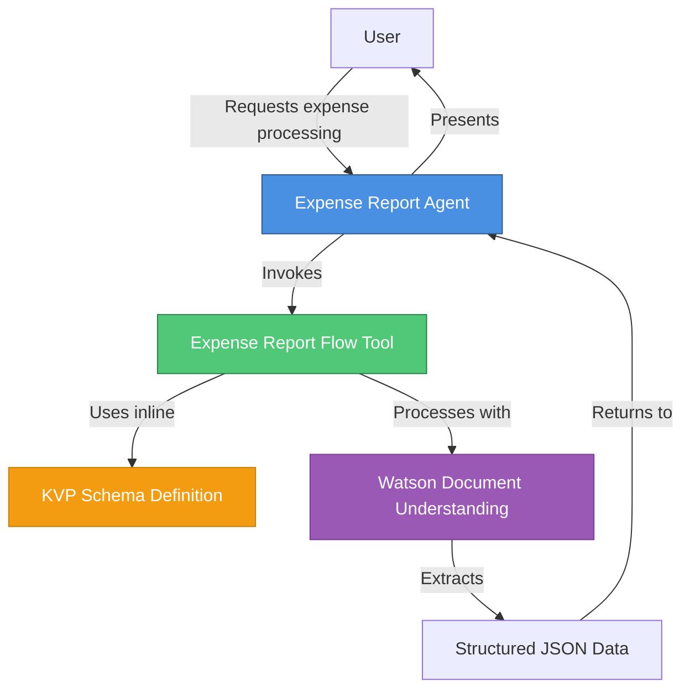
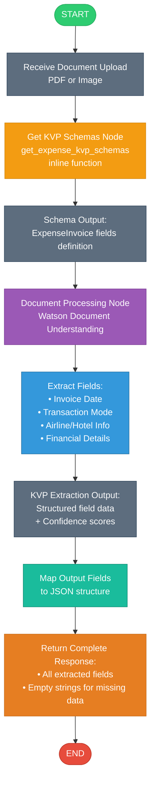

# Expense Report Agent

## Overview

A watsonx Orchestrate agent that processes expense report documents (airline invoices, hotel invoices, receipts) and extracts structured data using Watson Document Understanding with KVP (Key-Value Pair) extraction.

## Architecture Diagram



## Workflow Diagram



## Features

- **Automatic Document Processing**: Upload PDF or image files for instant data extraction
- **Comprehensive Field Extraction**: Extracts invoice, airline, hotel, and financial information
- **Intelligent Recognition**: Uses Watson Document Understanding with handwriting recognition
- **Structured Output**: Returns data in organized JSON format
- **Native Agent**: Built with watsonx Orchestrate native agent for optimal performance

## Extracted Fields

### Invoice Information (All Documents)
- **Invoice Date**: Date of the invoice
- **Transaction Mode**: Payment method (Credit Card, Bank Transfer, Cash, etc.)

### Airline Information (Airline Invoices)
- **Airline Name**: Name of the airline
- **Passenger Name**: Name of the passenger
- **Ticket Number**: Ticket/booking reference number
- **Ticket Date**: Date of ticket issuance
- **Flight Details**: Flight number, route, departure/arrival times

### Hotel Information (Hotel Invoices)
- **Hotel Name**: Name of the hotel
- **Customer Name**: Name of the guest
- **City**: City where hotel is located

### Financial Details (All Documents)
- **Base Fare**: Base charges/fare amount
- **Taxes**: Tax amount with breakdown if available
- **Total Amount**: Total amount to be paid
- **Currency**: Currency code (USD, EUR, etc.)

## Project Structure

```
wxo-agentic-workflow/
├── tools/
│   ├── __init__.py
│   └── expense_report_flow.py          # Document processing flow with inline KVP schema
├── agents/
│   └── expense_report_agent.yaml       # Agent configuration
├── generated/
│   └── expense_report_flow.json        # Compiled flow specification (generated)
├── main_flow.py                        # Programmatic testing script
├── import-all.sh                       # CLI import script
└── README.md                           # This file
```

## Usage

### Option 1: Via Chat Interface (Recommended)

1. **Import the agent and flow:**
   ```bash
   ./import-all.sh
   ```

2. **Start the chat interface:**
   ```bash
   orchestrate chat start
   ```

3. **Select the agent:**
   - Choose `expense_report_agent` from the agent list

4. **Process a document:**
   - Tell the agent you want to process an expense report
   - Upload your document (PDF or image) when prompted
   - Review the extracted data

### Option 2: Programmatic Testing

1. **Set up Python environment:**
   ```bash
   export PYTHONPATH=/path/to/adk/src:/path/to/adk
   ```

2. **Run the test script:**
   ```bash
   python3 main_flow.py
   ```

   This will:
   - Compile the flow
   - Generate the flow specification JSON
   - Display instructions for testing via chat interface

## Output Format

The agent returns extracted data in a structured JSON format:

```json
{
  "invoice_date": "2024-01-15",
  "transaction_mode": "Credit Card",
  "airline_name": "United Airlines",
  "passenger_name": "John Doe",
  "ticket_number": "UA123456789",
  "ticket_date": "2024-01-10",
  "flight_details": "UA1234 - SFO to JFK, Dep: 08:00, Arr: 16:30",
  "hotel_name": "",
  "customer_name": "",
  "city": "",
  "base_fare": "450.00",
  "taxes": "67.50",
  "total_amount": "517.50",
  "currency": "USD"
}
```

**Note**: Empty fields indicate that information wasn't found in the document (e.g., airline invoice won't have hotel information).

## Implementation Details

### KVP Schema

The KVP schema is defined inline in the flow file using a plain Python function (no `@tool` decorator). This approach:
- Simplifies the implementation
- Reduces the number of components to manage
- Makes the schema easily accessible within the flow

### Document Processing

The flow uses Watson Document Understanding's `docproc` node with:
- **Task**: `text_extraction` for KVP extraction
- **Document Structure**: Enabled for better field recognition
- **Handwriting Recognition**: Enabled to handle handwritten receipts
- **Output Format**: `DocProcOutputFormat.object` for JSON output

### Output Mapping

The flow maps extracted KVP data to output fields using expressions:
```python
expression="flow['extract_expense_data'].output.kvps[0].get('field_name', '') if flow['extract_expense_data'].output.kvps else ''"
```

This ensures:
- Safe access to KVP data (returns empty string if not found)
- Consistent output format
- No errors for missing fields

## Configuration

### Agent Configuration

- **LLM Model**: `groq/openai/gpt-oss-120b`
- **Agent Type**: Native
- **Style**: Default

### Flow Configuration

- **Input Schema**: `DocumentProcessingCommonInput` (standard for document flows)
- **Output Schema**: `ExpenseReportOutput` (custom Pydantic model)
- **KVP Schema**: Inline definition with 14 fields

## Testing

### Test with Sample Documents

1. **Airline Invoice**: Should extract airline name, passenger details, flight info, and amounts
2. **Hotel Invoice**: Should extract hotel name, guest name, city, and charges
3. **Mixed Receipt**: Should extract applicable fields and leave others empty

### Validation

After extraction, verify:
- All present fields are extracted correctly
- Missing fields return empty strings (not null or error)
- Financial amounts are accurate
- Dates are in correct format

## Troubleshooting

### Common Issues

1. **Import Errors**
   - Ensure virtual environment is activated
   - Verify watsonx SDK is installed: `pip list | grep ibm-watsonx-orchestrate`

2. **Flow Compilation Errors**
   - Check Python syntax in flow file
   - Verify all imports are correct
   - Ensure Pydantic models are properly defined

3. **Document Upload Issues**
   - Verify document is PDF or image format
   - Check file size (should be reasonable for processing)
   - Ensure document is readable (not corrupted)

4. **Missing Field Extractions**
   - Check if field exists in the document
   - Verify KVP schema field names match document content
   - Review Watson Document Understanding confidence scores

### Debug Mode

To see detailed flow execution:
```python
await flow_def.invoke({"input": "value"}, debug=True)
```

## Best Practices

1. **Document Quality**: Use clear, high-resolution scans for best results
2. **Field Validation**: Always review extracted data for accuracy
3. **Error Handling**: Check for empty fields that should have values
4. **Confidence Scores**: Review Watson's confidence scores for critical fields

## Dependencies

- Python 3.11+ (or 3.13+)
- ibm-watsonx-orchestrate SDK
- Watson Document Understanding service
- watsonx Orchestrate environment (local or production)

## Support

For issues or questions:
1. Check the troubleshooting section above
2. Review the watsonx Orchestrate documentation
3. Consult the ADK examples repository

## License

This project follows the licensing terms of the IBM watsonx Orchestrate ADK.

## Version History

- **v1.0.0** (2024-02-12): Initial release
  - Document processing flow with inline KVP schema
  - Native agent with groq/openai/gpt-oss-120b model
  - Support for airline and hotel invoices
  - 14 extractable fields across 4 categories